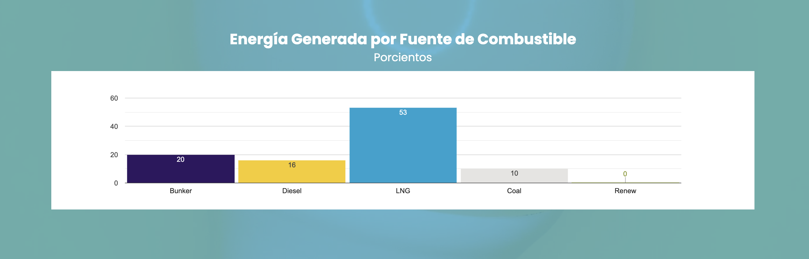

# Generación - por fuente de combustible

La gráfica que GeneraPR presenta en [su página](https://genera-pr.com/data-generacion) como "Energía generada por fuente de combustible". Es solo la proporción de cada fuente combustible, no los totales crudos.

## Schema

**Tabla:** genera_by_fuel

| column_name                        | column_type | null |
|------------------------------------|-------------|------|
| timestamp                          | TIMESTAMP   | YES  |
| timestamp_saved                    | TIMESTAMP   | YES  |
| fuel                              | VARCHAR      | YES  |
| value                               | BIGINT     | YES  |

Una captura de la tabla se compone de las siguientes filas:

## Descripción

Esta tabla se basa en la gráfica de "Energía generada por fuente de combustible". La gráfica cambia en un intervalo inespecificado, pero quizas cada 5-10 minutos. 

La variable "timestamp" contiene a la fecha y hora de "Actualizado" que GeneraPR provee y actualiza. Esta hora está en timezone de Puerto Rico. Mientras tanto, "timestamp_saved" indica cuando el bot archivó la información y utiliza el timezone UTC.

La variable "fuel" indica cual es la fuente de combustible. Mientras que "value" la proporción generada por tal fuente. Es un porciento sin normalizar. Un valor de 15% correspondería a 15.0 en vez de 0.15. La suma de los "value" para las cinco fuentes en un "timestamp" debería dar 100.0.

Las cinco fuentes de combustible son:
1. Bunker
2. Coal
3. Diesel
4. LNG
5. Renew

El orden de variables recomendado para sort la tabla es: "timestamp", "fuel"

