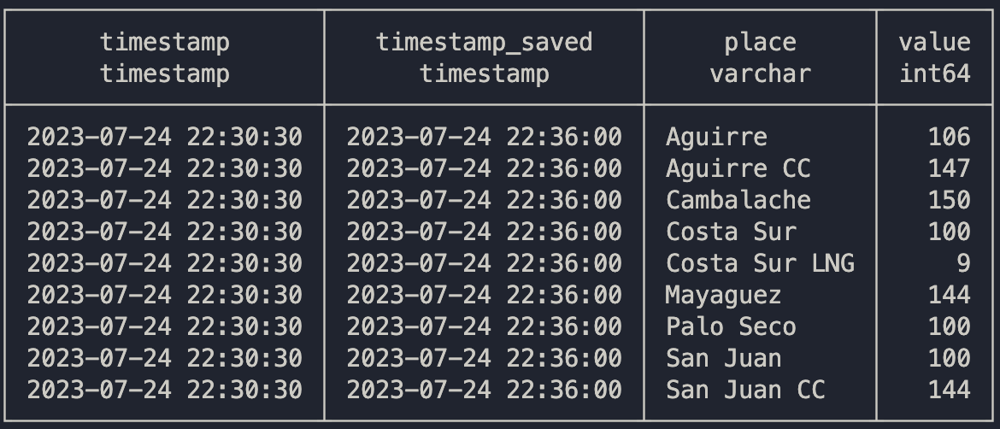

# Generación - costo de combustible

El precio del combustible por barril ($/BBL) en cada lugar.

## Schema

**Tabla:** genera_fuel_cost

| column_name                        | column_type | null |
|------------------------------------|-------------|------|
| timestamp                          | TIMESTAMP   | YES  |
| timestamp_saved                    | TIMESTAMP   | YES  |
| place                              | VARCHAR      | YES  |
| value                               | BIGINT     | YES  |

Una captura de la tabla se compone de las siguientes filas:

## Descripción

TODO: Añadir contexto y fuente.

La variable "timestamp" contiene a la fecha y hora de "Actualizado" que GeneraPR provee y actualiza. Esta hora está en timezone de Puerto Rico. Mientras tanto, "timestamp_saved" indica cuando el bot archivó la información y utiliza el timezone UTC.

La variable "place" indica cual es la planta mientras que "value" el costo de combustible por barril ($/BBL) en tal sitio.

Las nueve plantas son:
1. Aguirre
2. Aguirre CC
3. Cambalache
4. Costa Sur
5. Costa Sur LNG
6. Mayaguez
7. Palo Seco
8. San Juan
9. San Juan CC

El orden de variables recomendado para sort la tabla es: "timestamp", "place"

