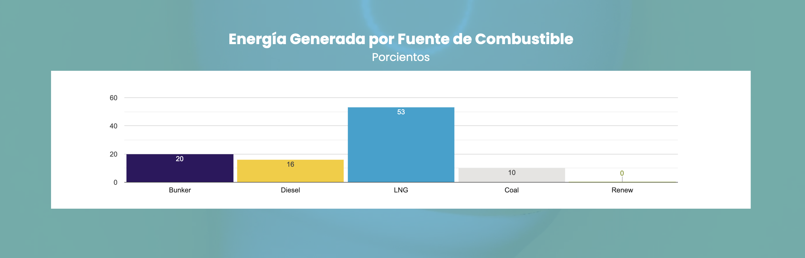

# Generación - carga por estación

La carga eléctrica que generan las estaciones y sus unidades individuales. 

## Schema

**Tabla:** genera_load_per_site

| column_name                        | column_type | null |
|------------------------------------|-------------|------|
| timestamp                          | TIMESTAMP   | YES  |
| timestamp_saved                    | TIMESTAMP   | YES  |
| site_index                              | VARCHAR      | YES  |
| type                               | VARCHAR     | YES  |
| desc                               | VARCHAR     | YES  |
| site_total                               | BIGINT     | YES  |
| unit_index                               | VARCHAR     | YES  |
| Unit                               | VARCHAR     | YES  |
| MW                               | BIGINT     | YES  |
| MVar                               | VARCHAR     | YES  |
| Cost                               | DOUBLE     | YES  |
| ParentId                               | VARCHAR     | YES  |

Una captura de la tabla se compone de las siguientes filas:

## Descripción

TODO: Añadir fuente y reescribir lenguaje. Añadir foto.

Esta tabla se basa en los indicadores de carga de estaciones de GeneraPR. Incluye detalles para unidades incluyendo MW, MVar y costo. Los valores cambian en un intervalo inespecificado, pero quizas cada 5-10 minutos. 

<!--  -->

La variable "timestamp" contiene a la fecha y hora de "Actualizado" que GeneraPR provee y actualiza. Esta hora está en timezone de Puerto Rico. Mientras tanto, "timestamp_saved" indica cuando el bot archivó la información y utiliza el timezone UTC.

Las variables site_index, "type", "desc" y site_total describen la carga total por fuente de energía en una estación. Un identificador de la estación en conjunto con su fuente de energía es "site_index"; su fuente de energía, "type"; su nombre, "desc" y su total generado, "site_total". Estas filas se repiten por cada unidad correspondiente que contenga dicha estación. El "site_index" se mantiene como varchar por ahora pero parece funcionar bien si cambiado a un integer. 

Las estaciones incluidas son las siguientes:

site_index | type | desc |
|------------------------------------|-------------|------|
0 | Hidroelectricas | Dos Bocas
1 | Hidroelectricas | Caonillas
2 | Hidroelectricas | Garzas
3 | Hidroelectricas | Rio Blanco
4 | Hidroelectricas | Toro Negro
5 | Hidroelectricas | Yauco
6 | COGEN | AES
7 | COGEN | Ecoelectrica
8 | Turbina de Gas | Estaciones GT
9 | Turbina de Gas | Mayaguez
10 | Turbina de Gas | Cambalache
11 | Ciclo Combinado | San Juan
12 | Ciclo Combinado | Aguirre Stag 1
13 | Ciclo Combinado | Aguirre Stag 2
14 | Vapor | San Juan
15 | Vapor | Palo Seco
16 | Vapor | Aguirre
17 | Vapor | Costa Sur
18 | Renovable | Wind
19 | Renovable | Solar
20 | Renovable | Landfill
21 | Turbina de Gas | Palo Seco
22 | Turbina de Gas | Aguirre
23 | Turbina de Gas | Costa Sur

Cada estación detalla la generación de sus unidades. Cada unidad se identifica con el conjunto de variables "site_index" y "unit_index", donde esta última funciona como "site_index". Asimismo, "Unit" nombra la unidad como "desc" a la estación.

El listado de las 89 unidades se incluye al final de este documento.

El orden de variables recomendado para sort la tabla es: "timestamp", "place"

## Unidades

site_index | type | desc | unit_index | Unit
|------------------------------------|-------------|------|--|---|
0 | Hidroelectricas | Dos Bocas | 0 | Hidro 1
0 | Hidroelectricas | Dos Bocas | 1 | Hidro 2
0 | Hidroelectricas | Dos Bocas | 2 | Hidro 3
1 | Hidroelectricas | Caonillas | 0 | Hidro 1
1 | Hidroelectricas | Caonillas | 1 | Hidro 2
2 | Hidroelectricas | Garzas | 0 | Hidro 1
2 | Hidroelectricas | Garzas | 1 | Hidro 2
2 | Hidroelectricas | Garzas | 2 | Hidro 3
3 | Hidroelectricas | Rio Blanco | 0 | Hidro 1
3 | Hidroelectricas | Rio Blanco | 1 | Hidro 2
4 | Hidroelectricas | Toro Negro | 0 | Hidro 1
4 | Hidroelectricas | Toro Negro | 1 | Hidro 2
4 | Hidroelectricas | Toro Negro | 2 | Hidro 3
4 | Hidroelectricas | Toro Negro | 3 | Hidro 4
4 | Hidroelectricas | Toro Negro | 4 | Hidro 5
5 | Hidroelectricas | Yauco | 0 | Hidro 1
5 | Hidroelectricas | Yauco | 1 | Hidro 2
5 | Hidroelectricas | Yauco | 2 | Hidro 3
6 | COGEN | AES | 0 | Unit 1
6 | COGEN | AES | 1 | Unit 2
7 | COGEN | Ecoelectrica | 0 | Gas 1
7 | COGEN | Ecoelectrica | 1 | Gas 2
7 | COGEN | Ecoelectrica | 2 | STG
8 | Turbina de Gas | Estaciones GT | 0 | Palo Seco
8 | Turbina de Gas | Estaciones GT | 1 | Vega Baja
8 | Turbina de Gas | Estaciones GT | 2 | Costa Sur
8 | Turbina de Gas | Estaciones GT | 3 | Jobos
8 | Turbina de Gas | Estaciones GT | 4 | Daguao
8 | Turbina de Gas | Estaciones GT | 5 | Yabucoa
8 | Turbina de Gas | Estaciones GT | 6 | Aguirre
8 | Turbina de Gas | Estaciones GT | 7 | FEMA GT PS
8 | Turbina de Gas | Estaciones GT | 8 | FEMA GT SJ
9 | Turbina de Gas | Mayaguez | 0 | Gas 1
9 | Turbina de Gas | Mayaguez | 1 | Gas 2
9 | Turbina de Gas | Mayaguez | 2 | Gas 3
9 | Turbina de Gas | Mayaguez | 3 | Gas 4
10 | Turbina de Gas | Cambalache | 0 | Gas 1
10 | Turbina de Gas | Cambalache | 1 | Gas 2
10 | Turbina de Gas | Cambalache | 2 | Gas 3
11 | Ciclo Combinado | San Juan | 0 | CTG 5
11 | Ciclo Combinado | San Juan | 1 | STG 5
11 | Ciclo Combinado | San Juan | 2 | CTG 6
11 | Ciclo Combinado | San Juan | 3 | STG 6
12 | Ciclo Combinado | Aguirre Stag 1 | 0 | Gas 1
12 | Ciclo Combinado | Aguirre Stag 1 | 1 | Gas 2
12 | Ciclo Combinado | Aguirre Stag 1 | 2 | Gas 3
12 | Ciclo Combinado | Aguirre Stag 1 | 3 | Gas 4
12 | Ciclo Combinado | Aguirre Stag 1 | 4 | STG 1
13 | Ciclo Combinado | Aguirre Stag 2 | 0 | Gas 1
13 | Ciclo Combinado | Aguirre Stag 2 | 1 | Gas 2
13 | Ciclo Combinado | Aguirre Stag 2 | 2 | Gas 3
13 | Ciclo Combinado | Aguirre Stag 2 | 3 | Gas 4
13 | Ciclo Combinado | Aguirre Stag 2 | 4 | STG 2
14 | Vapor | San Juan | 0 | Unit 7
14 | Vapor | San Juan | 1 | Unit 8
14 | Vapor | San Juan | 2 | Unit 9
14 | Vapor | San Juan | 3 | Unit 10
15 | Vapor | Palo Seco | 0 | Unit 1
15 | Vapor | Palo Seco | 1 | Unit 2
15 | Vapor | Palo Seco | 2 | Unit 3
15 | Vapor | Palo Seco | 3 | Unit 4
16 | Vapor | Aguirre | 0 | Unit 1
16 | Vapor | Aguirre | 1 | Unit 2
17 | Vapor | Costa Sur | 0 | Unit 3
17 | Vapor | Costa Sur | 1 | Unit 4
17 | Vapor | Costa Sur | 2 | Unit 5
17 | Vapor | Costa Sur | 3 | Unit 6
18 | Renovable | Wind | 0 | Pattern
19 | Renovable | Solar | 0 | San Fermin
19 | Renovable | Solar | 1 | Ilumina
19 | Renovable | Solar | 2 | Horizon
19 | Renovable | Solar | 3 | Coto Laurel
19 | Renovable | Solar | 4 | Oriana
19 | Renovable | Solar | 5 | Fonroche
20 | Renovable | Landfill | 0 | Toa Baja
20 | Renovable | Landfill | 1 | Fajardo
21 | Turbina de Gas | Palo Seco | 0 | CT Block 1
21 | Turbina de Gas | Palo Seco | 1 | CT Block 2
21 | Turbina de Gas | Palo Seco | 2 | CT Block 3
21 | Turbina de Gas | Palo Seco | 3 | GT1
21 | Turbina de Gas | Palo Seco | 4 | GT2
21 | Turbina de Gas | Palo Seco | 5 | GT3
21 | Turbina de Gas | Palo Seco | 6 | GT4
21 | Turbina de Gas | Palo Seco | 7 | GT5
21 | Turbina de Gas | Palo Seco | 8 | GT6
22 | Turbina de Gas | Aguirre | 0 | GT1
22 | Turbina de Gas | Aguirre | 1 | GT2
23 | Turbina de Gas | Costa Sur | 0 | GT1
23 | Turbina de Gas | Costa Sur | 1 | GT2
