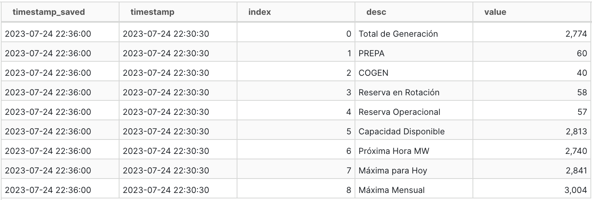
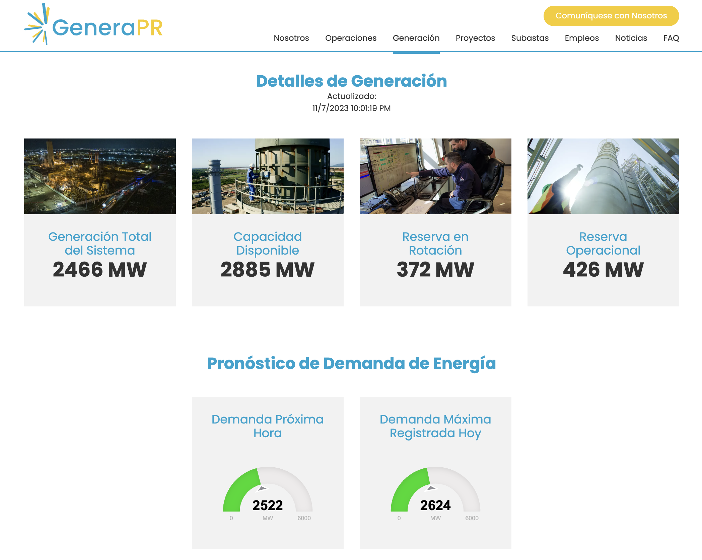

# Generación - Métricas

La tabla iniciales que GeneraPR presenta en [su página](https://genera-pr.com/data-generacion) pero con datos adicionales que ellos excluyen de su tabla.

## Schema
Tabla: genera_metrics

| column_name                        | column_type | null |
|------------------------------------|-------------|------|
| timestamp                          | TIMESTAMP   | YES  |
| timestamp_saved                    | TIMESTAMP   | YES  |
| index                              | BIGINT      | YES  |
| desc                               | VARCHAR     | YES  |
| value                              | BIGINT      | YES  |

Una captura de la tabla se compone de las siguientes filas:

## Descripción

Esta tabla se basa en las tablas de "Detalles de Generacion" y "Pronóstico de Demanda de Energía" de GeneraPR. Las tablas cambian en un intervalo inespecificado, pero quizas cada 5-10 minutos. 

La variable "timestamp" contiene a la fecha y hora de "Actualizado" que GeneraPR provee y actualiza. Esta hora está en timezone de Puerto Rico. Mientras tanto, "timestamp_saved" indica cuando el bot archivó la información y utiliza el timezone UTC.

El par de variables "index" y "desc" indican cual métrica la variable "value" cuantifíca. Estas son:

| index                        | desc | Unidades de "value" | Descripción
|------------------------------------|-------------|------|------|
| 0                          | Total de Generación   | MW (megawatts)  | Generación total del sistema
| 1                    | PREPA   | Porciento sin normalizar  | % de energía generada por AEE y GeneraPR
| 2                              | COGEN      | Porciento sin normalizar  | % de energía generada por Ecoeléctrica y AES
| 3                               | Reserva en Rotación     | MW  |
| 4                              | Reserva Operacional      | MW  |
| 5                              | Capacidad Disponible      | MW  |
| 6                              | Próxima Hora MW      | MW  | Proyección de demanda del sistema
| 7                              | Máxima para Hoy      | MW  | Mayor (demanda o generación??) del día
| 8                              | Máxima Mensual      | MW  | Mayor (demanda o generación??) del mes (corriente o calendarizado??)

Las dos variables de porcentaje no estan normalizadas. Un valor de 100% corresponde a un 100.0 en vez de 1.0. Esto es para mantenerse fiel a como GeneraPR presenta el dato. La suma de los "value" de las filas con "desc" de 'PREPA' y 'COGEN' debería sumar 100.0.

El orden de variables recomendado para sort la tabla es: "timestamp", "index"

