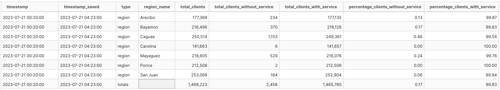
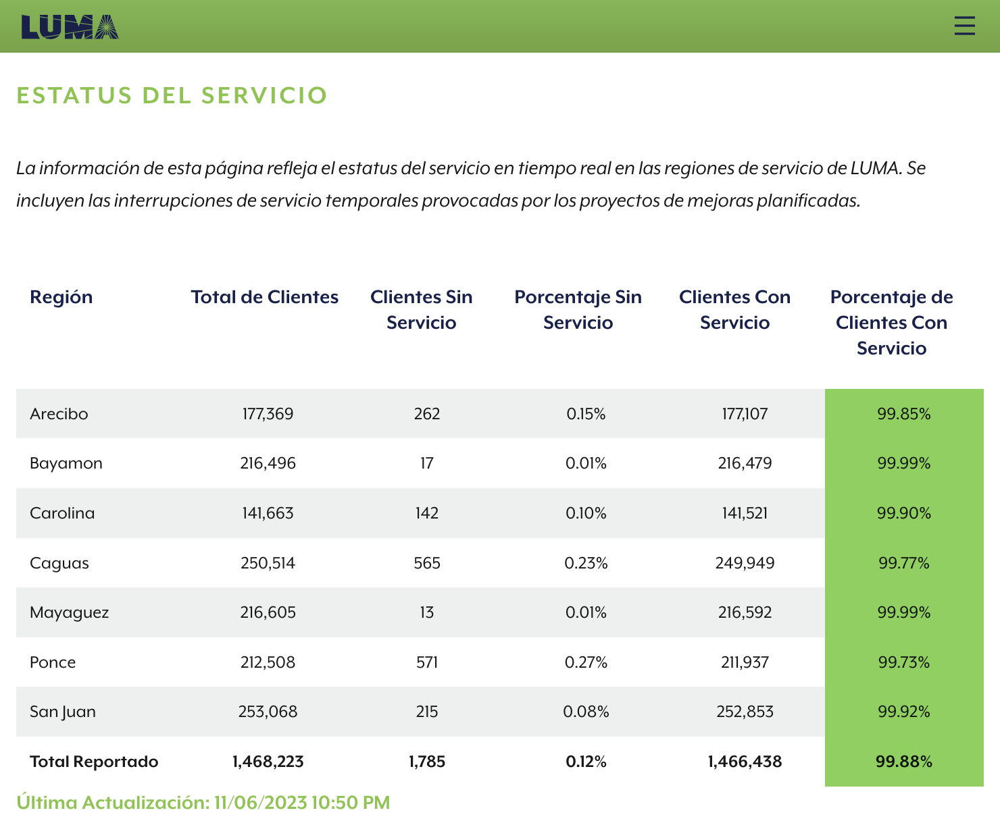

# Regiones sin servicio

La tabla verde de LUMA Energy que actualizan en su página ["Estatus del servicio"](https://miluma.lumapr.com/outages/serviceStatus) cada 5 minutos. Valores históricos desde finales de Julio 2023.

## Schema
Tabla: regions_without_service

| column_name                        | column_type | null |
|------------------------------------|-------------|------|
| timestamp                          | TIMESTAMP   | YES  |
| timestamp_saved                    | TIMESTAMP   | YES  |
| type                               | VARCHAR     | YES  |
| region_name                        | VARCHAR     | YES  |
| total_clients                      | BIGINT      | YES  |
| total_clients_without_service      | BIGINT      | YES  |
| total_clients_with_service         | BIGINT      | YES  |
| percentage_clients_without_service | DOUBLE      | YES  |
| percentage_clients_with_service    | DOUBLE      | YES  |

Una captura de la tabla se compone de las siguientes filas:

## Descripción

Esta tabla se basa en la tabla de Estatus de Servicio de LUMA. Dicha tabla cambia cada 5 minutos. Este dataset de regiones sin servicio archiva los valores históricos de la tabla de LUMA al mismo ritmo. 

La variable "timestamp" contiene a la fecha y hora de "Última Actualización" que LUMA provee y actualiza cada 5 minutos. Esta hora está en timezone de Puerto Rico. Mientras tanto, "timestamp_saved" indica cuando el bot archivó la información y utiliza el timezone UTC.